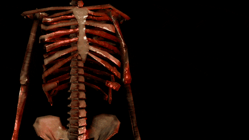

 

  

###

<h1 align="center">🎃 Привет👋 Меня зовут Руслан! 🎃</h1>

###

  
  

###

  

###

<h3 align="left">🧛‍♂️  Обо мне</h3>

###

Я начинающий Backend-разработчик, ориентированный на создание эффективных и масштабируемых систем. Мой путь в IT начался с изучения Node.js, но со временем я расширил свои знания, освоив PHP, HTML, JavaScript, ReactJS, а также немного изучил C#. В будущем хочу стать Fullstack-разработчиком, с основной специализацией на Backend! 🎯

Мое обучение включало завершение курса по PHP на платформе Skillbox, где я углубил знания в фреймворке Laravel. В рамках курса я участвовал в командной разработке интернет-магазина на Laravel, где активно работал над созданием функционала и улучшением производительности.

В настоящее время сосредоточен на личных проектах, постепенно выкладывая их на GitHub. Стремлюсь к постоянному росту в сфере разработки, соблюдая лучшие практики и стандарты кодирования. 🚀

###

 

###

<h3 align="left">🛠 Технологии:</h3>

###

  
  
                                                                                                                                                                                                                                       
  
    
  
  
  
  
  
  
  
  
  
  
  

###

<h3 align="left">🔥   Моя статистика :</h3>

###

  
  
  

###

<h3 align="left">🧛‍♂️ Дополнительная информация обо мне</h3>

###

Люблю вселенную SCP, чаще всего играю в SCP Secret Laboratory

- Любимый Scp, SCP-3114

  

- 🍬🍬🍬🍬🍬
- 🍬🍬🍬🍬🍬
- 🍬🍬🍬🍬🍬
- 🍬🍬🍬🍬🍬
- 🍬🍬🍬🍬🍬
- Не берите больше двух!

###
